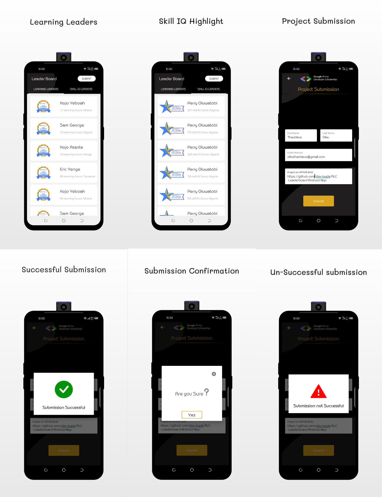

# GadsLeaderboard
Andela Learning Community Associate Android Developer Practice Project

# Task 
https://docs.google.com/document/d/1KS003bk1a-2bOfUnhXvnOPoHfPuKtdkTAQ_APljjgWc/edit

# Approach To the Task
The Application makes use of 
- The MVVM Pattern
- The repository pattern 
- Retrofit 
- View Binding
- Navigation Component 

# Screenshots 

# Application Downoad Link 
https://github.com/dev-loyde/ALC-Leaderboard-Android-App/blob/master/app/release/app-release.apk

# Installation
- Clone this repository and import into Android Studio
- Android studio version 4.0.1
- build gradle version 4.0.1
- compileSdkVersion 30
- kotlin version 1.3.72-release-Studio 4.0-5

# Generating Signed Apk 
- From Android Studio:
- Build menu
- Generate Signed APK...
- Fill in the keystore information (you only need to do this once manually and then let Android Studio remember it)

# Contributing 
- Fork it
- Create your feature branch (git checkout -b my-new-feature)
- Commit your changes (git commit -m ' feat : Add some feature') or (git commit -m 'chore : Some refactor')
- Push your branch (git push origin my-new-feature)
- Create a new Pull Request

